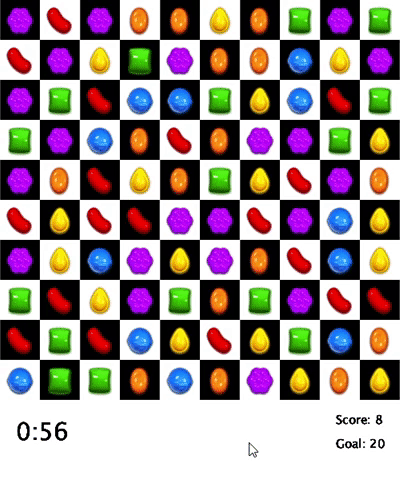

# Match-3 Candy

An interactive match-3 game modelled on Candy Crush with added time constraints for an extra challenge. To play, click on the candy you want to move and indicate the direction you want to move it in with an arrow key. The selected tile at any given time is surrounded with a green rectangle.

This project was built with Processing for Python. 
